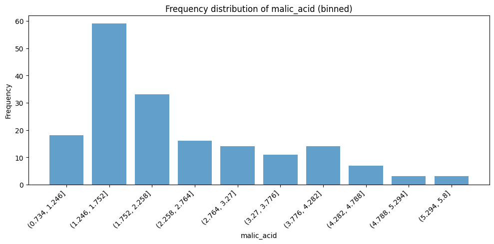
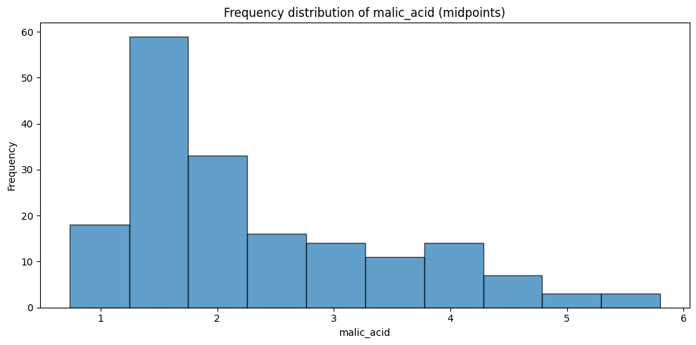
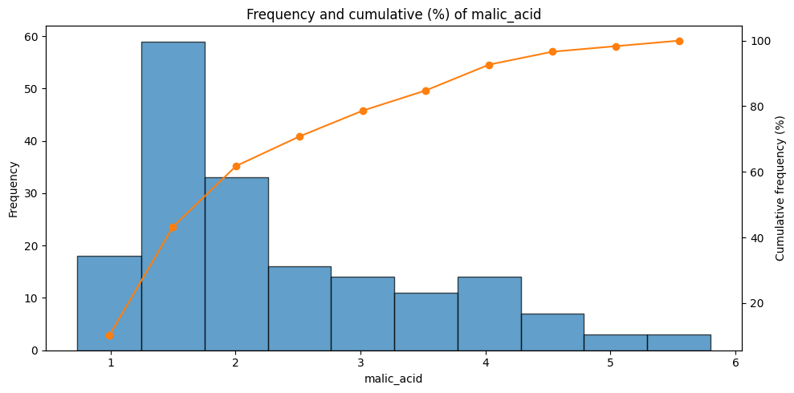
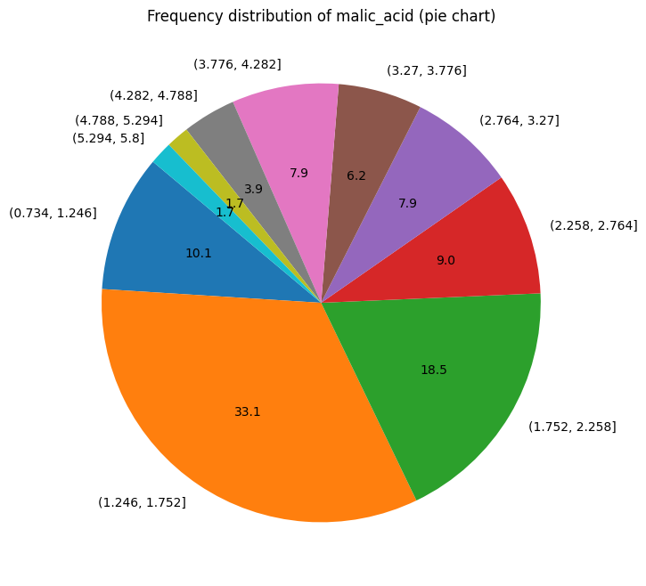

# Statistics for Data Mining (M.Sc.)

In this part we will load the data from `"../data/wine_dataset_assignment.csv"` and perform some basic statistical analysis.


```python
DATA_PATH = "../data/"
FILE_PATH = DATA_PATH + "wine_dataset_assignment.csv"
```


```python
# load the data using pandas
import pandas as pd

data = pd.read_csv(FILE_PATH)
```


```python
# show the table

data.head()
```


```python
# print a list of attributes/columns in the dataset

attrs = data.columns.tolist()
for attr in attrs:
    print(attr)
```


```python
# print the dtype of each column

dtypes = data.dtypes
for attr, dtype in zip(attrs, dtypes):
    print(f"{attr}: {dtype}")
```

### Basic Statistical Analysis

Perform initial statistical analyses where relevant, including:

* Mean, variance, standard deviation, median
* Mean absolute deviation
* Range, midrange, percentage of errors, and relevant proportions


```python
# perform statistical analysis on the numerical attributes

numerical_attrs = data.select_dtypes(include=['float64', 'int64']).columns.tolist()

for attr in numerical_attrs:
    col_data = data[attr]
    mean = col_data.mean()
    variance = col_data.var()
    std_dev = col_data.std()
    median = col_data.median()
    data_range = col_data.max() - col_data.min()
    midrange = (col_data.max() + col_data.min()) / 2

    print(f"Attribute: {attr}")
    print(f" Mean: {mean:.2f}")
    print(f" Variance: {variance:.2f}")
    print(f" Standard Deviation: {std_dev:.2f}")
    print(f" Median: {median:.2f}")
    print(f" Range: {data_range:.2f}")
    print(f" Midrange: {midrange:.2f}")
    print("-" * 40)
```


```python
# create a df for the results
import numpy as np

results = []
for attr in numerical_attrs:
    col_data = data[attr]
    results.append({
        "Attribute": attr,
        "Mean": col_data.mean(),
        "Variance": col_data.var(),
        "Standard Deviation": col_data.std(),
        "Median": col_data.median(),
        "Range": col_data.max() - col_data.min(),
        "Midrange": (col_data.max() + col_data.min()) / 2
    })
```


```python
# show the df
results_df = pd.DataFrame(results)

results_df
```

### Frequency Analysis

Create **frequency tables** including:

* Frequency, relative frequency, cumulative frequency
* Class boundaries (real and imaginary), class width
* Median, interquartile range, and relevant percentiles (e.g., 0.1, 0.9)


```python
import pandas as pd

selected_attr = numerical_attrs[1]
col_data = data[selected_attr].dropna()

n_bins = 10  # change as needed
binned = pd.cut(col_data, bins=n_bins, include_lowest=True)
freq_table = binned.value_counts().sort_index().reset_index()
freq_table.columns = ['Interval', 'Frequency']
freq_table['Relative Frequency'] = freq_table['Frequency'] / freq_table['Frequency'].sum()  # note .sum()
freq_table['Cumulative Frequency'] = freq_table['Frequency'].cumsum()

freq_table
```


<div>
<style scoped>
    .dataframe tbody tr th:only-of-type {
        vertical-align: middle;
    }

    .dataframe tbody tr th {
        vertical-align: top;
    }

    .dataframe thead th {
        text-align: right;
    }
</style>
<table border="1" class="dataframe">
  <thead>
    <tr style="text-align: right;">
      <th></th>
      <th>Interval</th>
      <th>Frequency</th>
      <th>Relative Frequency</th>
      <th>Cumulative Frequency</th>
    </tr>
  </thead>
  <tbody>
    <tr>
      <th>0</th>
      <td>(0.734, 1.246]</td>
      <td>18</td>
      <td>0.101124</td>
      <td>18</td>
    </tr>
    <tr>
      <th>1</th>
      <td>(1.246, 1.752]</td>
      <td>59</td>
      <td>0.331461</td>
      <td>77</td>
    </tr>
    <tr>
      <th>2</th>
      <td>(1.752, 2.258]</td>
      <td>33</td>
      <td>0.185393</td>
      <td>110</td>
    </tr>
    <tr>
      <th>3</th>
      <td>(2.258, 2.764]</td>
      <td>16</td>
      <td>0.089888</td>
      <td>126</td>
    </tr>
    <tr>
      <th>4</th>
      <td>(2.764, 3.27]</td>
      <td>14</td>
      <td>0.078652</td>
      <td>140</td>
    </tr>
    <tr>
      <th>5</th>
      <td>(3.27, 3.776]</td>
      <td>11</td>
      <td>0.061798</td>
      <td>151</td>
    </tr>
    <tr>
      <th>6</th>
      <td>(3.776, 4.282]</td>
      <td>14</td>
      <td>0.078652</td>
      <td>165</td>
    </tr>
    <tr>
      <th>7</th>
      <td>(4.282, 4.788]</td>
      <td>7</td>
      <td>0.039326</td>
      <td>172</td>
    </tr>
    <tr>
      <th>8</th>
      <td>(4.788, 5.294]</td>
      <td>3</td>
      <td>0.016854</td>
      <td>175</td>
    </tr>
    <tr>
      <th>9</th>
      <td>(5.294, 5.8]</td>
      <td>3</td>
      <td>0.016854</td>
      <td>178</td>
    </tr>
  </tbody>
</table>
</div>


```python
# show the results
freq_table
```


<div>
<style scoped>
    .dataframe tbody tr th:only-of-type {
        vertical-align: middle;
    }

    .dataframe tbody tr th {
        vertical-align: top;
    }

    .dataframe thead th {
        text-align: right;
    }
</style>
<table border="1" class="dataframe">
  <thead>
    <tr style="text-align: right;">
      <th></th>
      <th>Interval</th>
      <th>Frequency</th>
      <th>Relative Frequency</th>
      <th>Cumulative Frequency</th>
    </tr>
  </thead>
  <tbody>
    <tr>
      <th>0</th>
      <td>(0.734, 1.246]</td>
      <td>18</td>
      <td>0.101124</td>
      <td>18</td>
    </tr>
    <tr>
      <th>1</th>
      <td>(1.246, 1.752]</td>
      <td>59</td>
      <td>0.331461</td>
      <td>77</td>
    </tr>
    <tr>
      <th>2</th>
      <td>(1.752, 2.258]</td>
      <td>33</td>
      <td>0.185393</td>
      <td>110</td>
    </tr>
    <tr>
      <th>3</th>
      <td>(2.258, 2.764]</td>
      <td>16</td>
      <td>0.089888</td>
      <td>126</td>
    </tr>
    <tr>
      <th>4</th>
      <td>(2.764, 3.27]</td>
      <td>14</td>
      <td>0.078652</td>
      <td>140</td>
    </tr>
    <tr>
      <th>5</th>
      <td>(3.27, 3.776]</td>
      <td>11</td>
      <td>0.061798</td>
      <td>151</td>
    </tr>
    <tr>
      <th>6</th>
      <td>(3.776, 4.282]</td>
      <td>14</td>
      <td>0.078652</td>
      <td>165</td>
    </tr>
    <tr>
      <th>7</th>
      <td>(4.282, 4.788]</td>
      <td>7</td>
      <td>0.039326</td>
      <td>172</td>
    </tr>
    <tr>
      <th>8</th>
      <td>(4.788, 5.294]</td>
      <td>3</td>
      <td>0.016854</td>
      <td>175</td>
    </tr>
    <tr>
      <th>9</th>
      <td>(5.294, 5.8]</td>
      <td>3</td>
      <td>0.016854</td>
      <td>178</td>
    </tr>
  </tbody>
</table>
</div>


```python
import matplotlib.pyplot as plt

# freq_table assumed to have columns: 'Interval' (pd.Interval) and 'Frequency'
x_labels = freq_table['Interval'].astype(str)

plt.figure(figsize=(10, 5))
plt.bar(x_labels, freq_table['Frequency'], alpha=0.7, color='C0')
plt.xticks(rotation=45, ha='right')
plt.xlabel(selected_attr)
plt.ylabel('Frequency')
plt.title(f'Frequency distribution of {selected_attr} (binned)')
plt.tight_layout()
plt.show()
```


    

    


```python
import matplotlib.pyplot as plt

# requires 'Interval' column of Interval objects (from pd.cut)
midpoints = freq_table['Interval'].apply(lambda iv: iv.mid)
widths = freq_table['Interval'].apply(lambda iv: iv.right - iv.left)

plt.figure(figsize=(10, 5))
plt.bar(midpoints, freq_table['Frequency'], width=widths, align='center', alpha=0.7, color='C0', edgecolor='k')
plt.xlabel(selected_attr)
plt.ylabel('Frequency')
plt.title(f'Frequency distribution of {selected_attr} (midpoints)')
plt.tight_layout()
plt.show()
```


    

    


```python
fig, ax1 = plt.subplots(figsize=(10, 5))
ax2 = ax1.twinx()

# bars (midpoint version)
ax1.bar(midpoints, freq_table['Frequency'], width=widths, alpha=0.7, color='C0', edgecolor='k')
ax1.set_ylabel('Frequency')

# cumulative (as percent)
cum_pct = freq_table['Frequency'].cumsum() / freq_table['Frequency'].sum() * 100
ax2.plot(midpoints, cum_pct, color='C1', marker='o')
ax2.set_ylabel('Cumulative frequency (%)')

ax1.set_xlabel(selected_attr)
ax1.set_title(f'Frequency and cumulative (%) of {selected_attr}')
plt.tight_layout()
plt.show()
```


    

    


```python
# create a pie chart
plt.figure(figsize=(8, 8))
plt.pie(freq_table['Frequency'], labels=x_labels, autopct='%1.1f', startangle=140)
plt.title(f'Frequency distribution of {selected_attr} (pie chart)')
plt.show()
```


    

    

